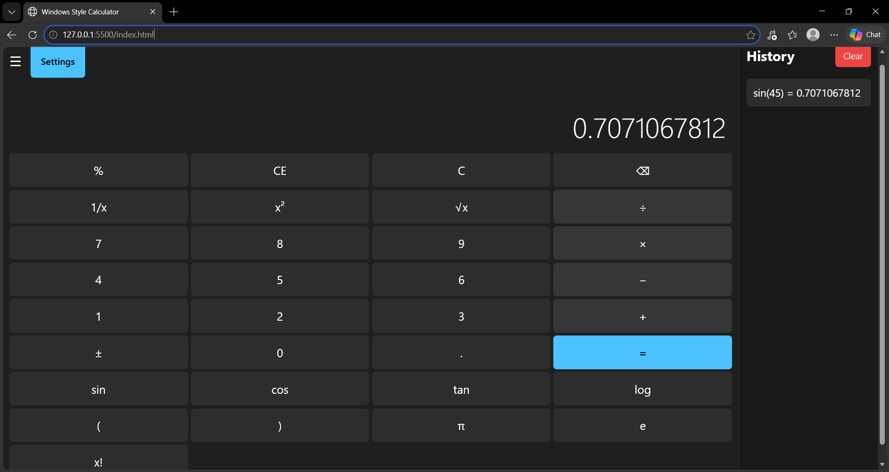
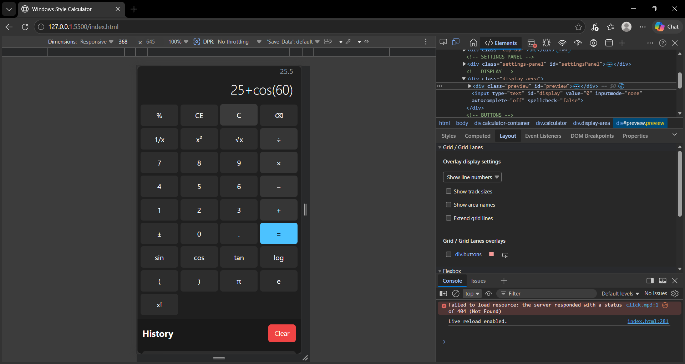

<h1 align="center">🧮 CodeAlpha Scientific Calculator</h1>

<p align="center">
  Modern • Responsive • Scientific • Stylish
</p>

---

## 🚀 Live Demo

🔗 https://srinaina2007-sudo.github.io/CodeAlpha_Calculator/

---

## 📸 Preview

### Desktop View


### Mobile View


---

## ✨ Features

✅ Basic Arithmetic Operations  
✅ Scientific Functions  
✅ Responsive Design  
✅ Keyboard Support  
✅ Smooth Animations  
✅ Modern UI  
✅ Error Handling  

---

## 🛠️ Technologies Used

- HTML5
- CSS3
- JavaScript

---

## 📂 Project Structure

```bash
CodeAlpha_Calculator/
│── index.html
│── style.css
│── script.js
│── README.md
│── images/
```

---

## 🎯 Scientific Functions Included

- Sin
- Cos
- Tan
- Square Root
- Power
- Percentage
- Logarithm

---

## 💡 What I Learned

- DOM Manipulation
- Event Handling
- Responsive Web Design
- JavaScript Functions
- UI/UX Design

---

## 👨‍💻 Author

Sri Naina

GitHub:
https://github.com/srinaina2007-sudo

---

## ⭐ Support

If you like this project, give it a star ⭐